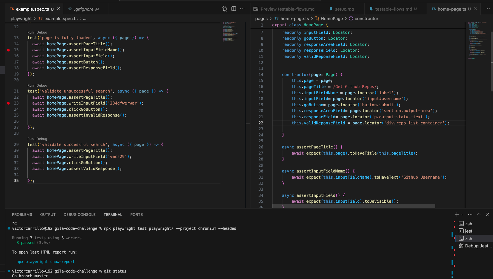
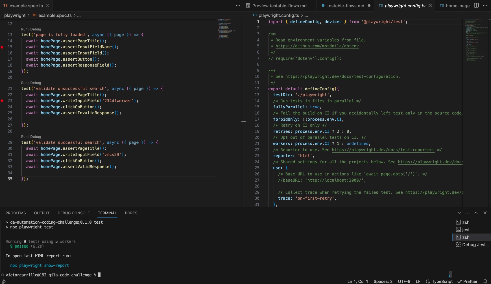

npm audit fix --force

yarn install

run yarn start

Make sure to install playwright by using : 
`npm i` to install all node modules

To run the tests :
`npx playwright test playwright/ --project=chromium --headed` - To run tests only in Chrome

`npm test` - Will run tests in different version and browsers headless.

Launches the webserver, and executes the existing Playwright Tests.

## Testable Flows
1. Validate application is fully loaded
2. Validate if an unsuccessful search is done, the response will be "No repos"
3. Validate if an successful search is done, the response will contain repo names.
4. Validate the format of the response

### To consider :
* If the application needs refinement it can be implemented while creating new mocks.
* Make sure to have usernames that contain valid PUBLIC  repos in order to create a search
* Discard the private repos while parametrizing test data.

